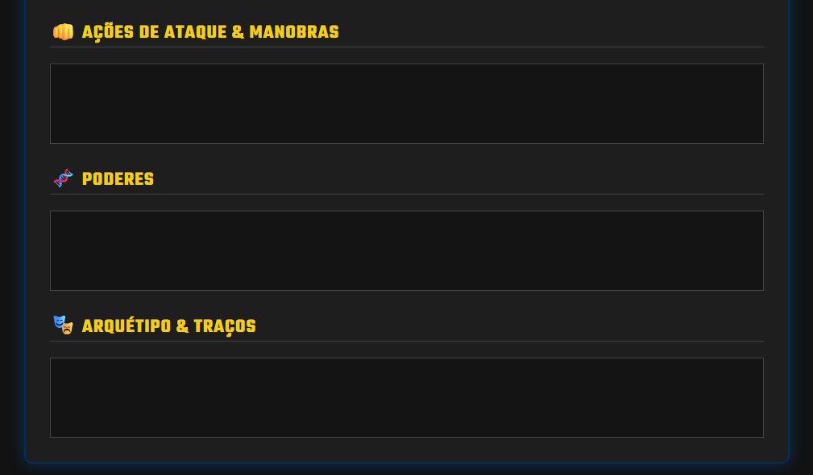
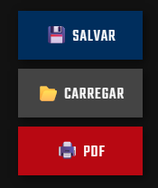

# 🦇 Ficha Editável: Justice League Unlimited RPG

> *“Eu sou a vingança. Eu sou a noite. Eu sou... BATMAN!”*

Este repositório hospeda uma **Ficha de Personagem Interativa e Editável** para o sistema de RPG **Justice League Unlimited (JLU)**.

---

## 🖼️ Prévia da Ficha Interativa

Abaixo, veja o visual do monitor de status e dos controles da Torre de Vigilância:

### Seção 1: Identidade e Atributos
<p align="center">
  
</p>

### Seção 2: Edição de Poderes
<p align="center">
  
</p>

### Seção 3: Barra de Ações
<p align="center">
  
</p>

---

## ⚡ Funcionalidades Principais

* **📝 Totalmente Editável:** Clique e digite. Todos os campos são editáveis diretamente na página.
* **💾 Sistema de Save/Load:** Baixa e carrega o estado da ficha através de um arquivo `.json`.
* **🎖️ Seletor de Tier (Rank):** Botões interativos para alternar o nível do herói (D, C, B, A, S).
* **🩸 Condições de Saúde:** Botões de marcar/desmarcar ferimentos.
* **🖨️ Impressão Full Dark:** O sistema gera PDFs preservando o fundo escuro e as cores neon da interface.
* **📐 Campos Expansíveis:** As caixas de texto (Poderes, Histórico) crescem automaticamente conforme você digita.

## 🚀 Como Usar Online

Acesse a versão mais recente hospedada no GitHub Pages:
🔗 **[Clique aqui para abrir a Ficha](https://yuyukiin.github.io/ficha-editavel-justice-league-unlimited-rpg/)**

## 🛠️ Como Instalar / Hospedar

1.  **Clone o repositório:**
    ```bash
    git clone [https://github.com/SEU-USUARIO/ficha-editavel-justice-league-unlimited-rpg.git](https://github.com/SEU-USUARIO/ficha-editavel-justice-league-unlimited-rpg.git)
    ```
2.  **Abra o arquivo:** Basta dar dois cliques no `index.html`.

## ⚖️ Aviso Legal (Disclaimer)

Este é um projeto de fã para fãs, sem fins lucrativos.

* **Justice League Unlimited RPG** é um sistema desenvolvido e publicado no Brasil pela **[D20 Culture](https://d20culture.com/)**. Todos os direitos das mecânicas pertencem a eles.
* **Justice League** e todos os personagens relacionados são marcas registradas da **DC Comics** e **Warner Bros. Discovery**.

---
Desenvolvido com ❤️ e dedicação.